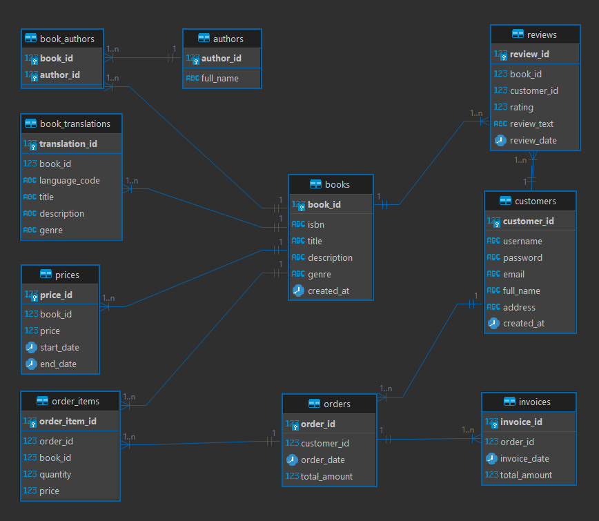

# Bookstore Database Project

## Project Overview
This project implements a PostgreSQL database for a bookstore, including the schema, sample data generation, and report queries.

## Project Structure

### Root Directory
- `Dockerfile`: Dockerfile to set up the PostgreSQL database in a container.
- `init.sql`: SQL script to create the database schema.

### `functions/` Directory
This directory contains SQL scripts for functions used in the database.
- `generate_sample_data.sql`: Function to generate sample data.
- `recommend_books_to_user.sql`: Function to generate book recommendations given a user.

### `reports/` Directory
This directory contains SQL scripts for generating reports.
- `sales_stats_query.sql`: Query to generate the sales stats report by genre, month, and the previous month.

### `diagrams/` Directory
This directory contains visual representations of the database schema.
- `ERM.png`: Entity-Relationship Model (ERM) diagram of the database.

## Diagrams

### ERM Diagram
The ERM diagram provides a visual representation of the database schema, showing the entities and relationships between them.


## Running the PostgreSQL Database with Docker

### Prerequisites
- Docker installed on your system
- Basic knowledge of command line interface

### Step-by-Step Instructions

1. **Build the Docker Image**
   Open a terminal and navigate to the directory containing the `Dockerfile`. Run the following command to build the Docker image:

    ```sh
    docker build -t bookstore-db-image .
    ```

3. **Run the PostgreSQL Container**
   Once the image is built, you can run a container from it. Execute the following command:

    ```sh
    docker run -d --name bookstore-db-container -p 5432:5432 bookstore-db-image
    ```

   This command will run the PostgreSQL container in detached mode (`-d`), name the container `bookstore-db-container`, and map the PostgreSQL port 5432 from the container to your host machine.

4. **Connect to the PostgreSQL Database**
   You can connect to the PostgreSQL database using any PostgreSQL client. For example, you can use `psql` or a GUI tool like pgAdmin.

   **Using psql:**

    ```sh
    psql -h localhost -p 5432 -U your_user -d bookstore-db
    ```

   You will be prompted to enter the password (`your_password`).

   **Using pgAdmin:**

    1. Open pgAdmin.
    2. Create a new server with the following details:
       - **Host**: `localhost`
       - **Port**: `5432`
       - **Username**: `your_user`
       - **Password**: `your_password`
       - **Database**: `bookstore-db`

5. **Initialize the Database Schema and Sample Data**
   Once connected to the PostgreSQL database, you can initialize the schema and insert sample data by executing the provided SQL scripts.

   **Initialize Schema:**

    Run the SQL script that contains your database schema. You can do this through the `psql` command line or pgAdmin's query tool.

    ```sh
    psql -h localhost -p 5432 -U your_user -d bookstore-db -f /path/to/init.sql
    ```

   **Insert Sample Data:**

    Similarly, run the SQL script to insert sample data.

    ```sh
    psql -h localhost -p 5432 -U your_user -d bookstore-db -f /path/to/functions/generate_sample_data.sql
    ```

6. **Call the Functions**
   To test the functions, you can execute the following SQL commands in your PostgreSQL client:

    ```sql
    SELECT generate_sample_data();
    SELECT * FROM recommend_books_to_user(1);
    ```

## Stopping and Removing the Container

To stop the running container, use:

```sh
    docker stop bookstore-db-container
```
## Conclusion
You have now set up a PostgreSQL database for the Bookstore project using Docker.